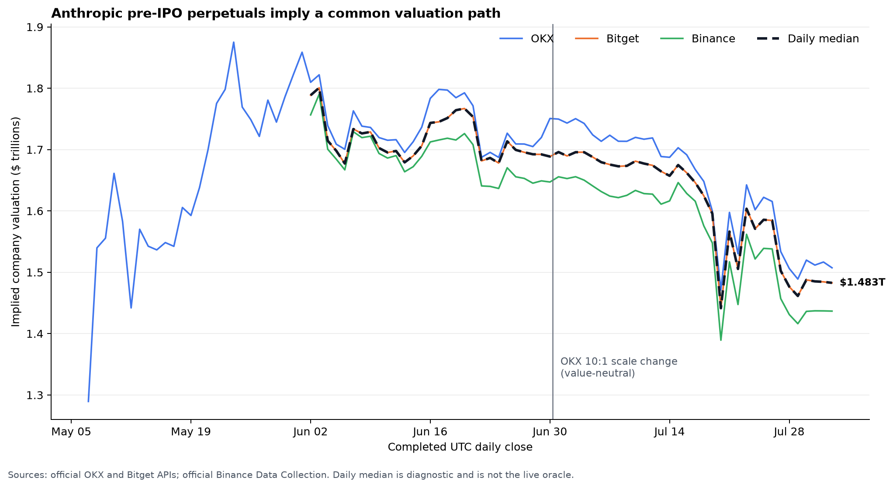
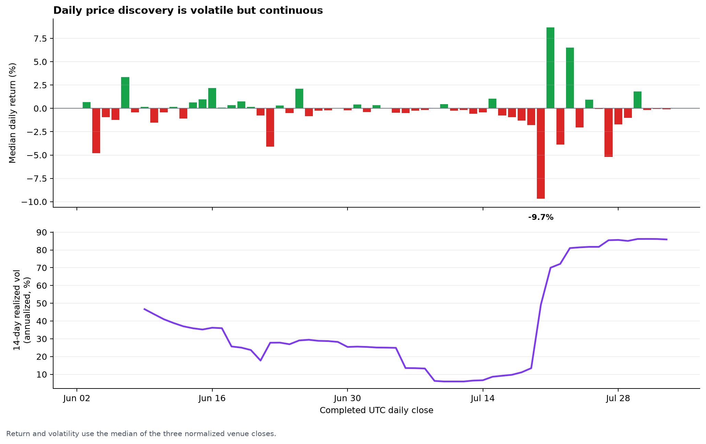
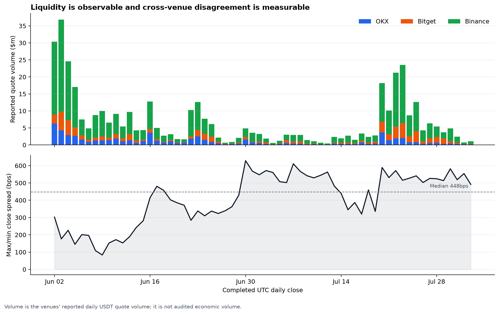
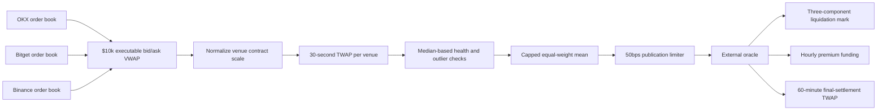

# Anthropic implied-valuation oracle

This document describes the oracle, mark-price, funding, and settlement design
for an Anthropic pre-IPO perpetual market. The oracle constructs a continuously
tradable implied company valuation from independent public perpetual-futures
order books on OKX, Bitget, and Binance.

The core design principle is simple:

> The local perpetual never determines its own external oracle. If fewer than
> two independent external sources remain reliable, new positions are disabled
> instead of manufacturing or carrying forward a fresh price.

The architecture follows trade.xyz's public separation of external oracle,
liquidation mark, hourly funding, and final settlement. The Anthropic
multi-venue source construction is custom because no standard Anthropic spot
index exists.


## Documentation and research in this repository

- [`ORACLE_SPEC.md`](ORACLE_SPEC.md) — oracle, mark-price, funding,
  failure-mode, and settlement specification in questionnaire form.
- [`research/HISTORICAL_PRICING.md`](research/HISTORICAL_PRICING.md) —
  historical pricing and liquidity research: results, methodology,
  normalization, the OKX rebase, and limitations.
- [`research/anthropic_perp_history.ipynb`](research/anthropic_perp_history.ipynb)
  — executable Jupyter notebook reproducing the analysis.
- [`research/data/anthropic_perp_daily.csv`](research/data/anthropic_perp_daily.csv)
  — normalized historical dataset with a source URL on every row, plus a
  [wide-form CSV](research/data/anthropic_perp_daily_wide.csv) and
  [machine-readable summary](research/data/historical_summary.json).
- [`research/build_history.py`](research/build_history.py) — reproducible
  data-acquisition and analysis code that regenerates every dataset,
  statistic, chart, and the notebook.
- [`research/charts/`](research/charts/) — valuation-history, volatility, and
  liquidity/cross-venue-dispersion charts in PNG and SVG.

## Historical evidence

The historical study uses completed UTC daily candles through August 2, 2026.
It is deliberately separate from the live impact-price oracle.



Across the common June 2–August 2 period:

- Median valuation declined from $1.789T to $1.483T, a 17.1% move.
- Annualized realized volatility was 45.5%.
- The largest median daily move was −9.66%.
- Pairwise daily-return correlations were 0.967–0.989.
- Latest-30-day reported quote volume totaled $154.85M, or $5.16M per day.
- Median max/min venue-close dispersion was 448bps.

This is the behavior expected from a volatile growth-equity market, not a stale
private-company valuation mark. The high return correlations demonstrate a
shared economic signal. The non-zero level dispersion is why the live oracle
uses an explicit, auditable multi-venue rule instead of selecting whichever
venue is most convenient.





The historical pipeline uses OKX and Bitget official APIs and the official
Binance futures API, falls back to Binance Data Collection ZIP files with
verified published SHA-256 checksums where jurisdiction requires, and
regenerates every figure and statistic from normalized checked-in data in a
network-free mode.

## Live oracle flow



### 1. Executable prices, not last trades

For each venue, the oracle walks both sides of the visible order book and
calculates the average execution prices for a fixed $10,000 quote notional:

```text
venue impact mid = (impact bid VWAP + impact ask VWAP) / 2
```

The same quote notional is used on every venue so contracts with different raw
prices receive a comparable liquidity test. Last trades are excluded because a
small isolated print is not a reproducible hedge price.

A book is invalid when it is:

- more than ten seconds old;
- crossed or malformed;
- wider than 500bps at the top of book;
- missing the complete impact notional on either side; or
- timestamped materially ahead of the local clock.

### 2. Normalize incompatible contract scales

The raw venue prices are not directly comparable:

| Venue | Market | Current nominal share basis |
|---|---|---:|
| OKX | `ANTHROPIC-USDT-SWAP` | 10,000,000,000 |
| Bitget | `ANTHROPICUSDT` | 1,000,000,000 |
| Binance | `ANTHROPICUSDT` | 1,000,000,000 |

```text
implied whole-company valuation
= venue impact mid × venue nominal share basis
```

OKX changed its scale 10:1 on June 30, 2026 while preserving economic value.
The basis metadata is versioned as `anthropic-2026-06-30-v1`. A subsequent
stale basis would create an approximately tenfold cross-venue disagreement and
fail closed rather than contaminate the composite.

The nominal share basis is an exchange contract convention. It is not a claim
about Anthropic's legal fully diluted share count and does not confer equity
ownership.

### 3. Require a real per-venue TWAP window

Each normalized venue value enters its own continuous-time, piecewise-constant
30-second TWAP. The engine normally samples every three seconds.

- A venue needs at least 27 seconds of coverage before it becomes eligible.
- A gap longer than ten seconds resets that venue's window.
- Startup therefore remains warming/reduce-only until the window is real.
- A stale pre-outage observation cannot silently enter a post-outage price.

### 4. Transparent cross-venue rule

Let `m` be the median of the eligible per-venue TWAPs:

| Deviation from `m` | Treatment |
|---|---|
| Below 10% | Full weight |
| 10% to below 20% | Cap at `m ± 10%` |
| 20% or more | Exclude |

The remaining values are equal-weighted. At least two independent values must
remain. If exactly two remain, their high/low divergence must be below 20%.

The median identifies inconsistent sources; it is not normally the published
number. The target is a linear equal-weight basket of the surviving capped
venue values, which makes the rule straightforward for market makers to
replicate and hedge.

### 5. Publication limit

Each external-oracle publication can move at most 50bps from the previous
publication. This follows the public trade.xyz approach and protects downstream
mark and liquidation logic from a discontinuous single update.

A real large move confirmed by the external venues is not rejected. It remains
the target, and the published value reaches it through successive approximately
three-second updates.

## Liquidation mark

Liquidations do not use a local last trade. The mark engine publishes the
median of:

1. the independent external oracle;
2. the external oracle plus a 150-second continuous-time EMA of local
   mid-minus-oracle basis; and
3. the median of local best bid, best ask, and last trade.

The resulting mark is also limited to a 50bps change per update. Separating mark
from external oracle prevents a trader from directly moving the local
liquidation price with one small trade while still allowing sustained local
basis to enter gradually.

## Funding

Funding is peer-to-peer and paid hourly. It uses the trade.xyz custom formula:

```text
F = 0.5 × [P + clamp(r - P, -0.0005, 0.0005)]
```

where:

```text
P = hourly time average of
    [max(impact_bid - oracle, 0)
     - max(oracle - impact_ask, 0)] / oracle

r = 0.0000125 per hour
```

Operational parameters:

- local funding impact notional: $1,000, matching trade.xyz;
- premium sampled at every oracle update and time-weighted over the hour;
- minimum hourly sampling coverage: 95%;
- maximum sampling gap: 15 seconds;
- funding multiplier: 0.5×;
- funding cap: ±4% per hour; and
- payment: `position size × oracle price × funding rate`.

The 0.5× multiplier reduces the standard Hyperliquid-style neutral carry from
approximately 11.6% to approximately 5.5% simple annualized. That is more
appropriate for an equity-like market than the full crypto-specific dollar
borrow-versus-spot carry assumption.

Funding can reduce account equity and contribute to liquidation, but funding is
not the liquidation price. Liquidations use the separate mark above.

## Failure and settlement behavior

| Condition | Oracle/market result |
|---|---|
| Three valid independent venues | `healthy`; new positions allowed |
| Two agreeing independent venues | `degraded`; new positions allowed |
| One or zero usable venues | `reduce_only`; no fresh oracle value |
| Only two venues differ by at least 20% | `reduce_only` |
| Fewer than two survive outlier checks | `reduce_only` |
| Known rebase without updated metadata | Disable new positions until versioned |

The last good valuation is exposed for operations and incident review, but is
not labeled as a fresh oracle observation.

Final settlement uses at least 95% coverage of a 60-minute external-oracle TWAP
ending exactly at the final funding timestamp. Final funding is paid, resting
orders are cancelled, and positions are cash-settled at that TWAP. One venue's
forced-settlement or delisting value cannot unilaterally settle the local market.

On a confirmed IPO, the recommended policy is to end pre-IPO oracle admission,
complete the documented funding/TWAP settlement, and conduct new price discovery
against the listed stock under a separately approved stock-oracle specification.

## SEDA transport

Delivery on-chain uses a programmable SEDA Oracle Program:

- Each executor fetches executable books, normalizes scales, and computes the
  instantaneous robust venue composite.
- An on-chain request asks for five executor replicas.
- The tally requires at least three valid reveals and takes their median.
- Execution and tally return exactly 16 bytes: a big-endian `u128` containing
  whole-USD implied valuation.
- A consuming relayer supplies the stateful 30-second TWAP, publication clamp,
  mark, funding, and final-settlement logic.

SEDA Fast offers signed low-latency execution but is not represented as
multi-executor consensus. No Pyth, Chainlink, RedStone, or Kaiko Anthropic feed
is assumed unless exact instrument coverage and failure behavior are separately
confirmed.

## Liquidity and launch readiness

Planned launch support includes:

- Everhaven;
- Evan Semet, a quantitative researcher formerly at DRW;
- at least $1 million of project-supported liquidity and self-market-making
  capacity; and
- active conversations with Jump Trading, SIG, DRW, and Wintermute.

The latter firms are discussions, not represented as commitments until
onboarding and commercial terms are complete.

The launch will be distributed through coordinated project channels, a Y
Combinator launch post, and an Alliance launch post. The base planning range is
$30M–$90M of first-30-day volume, not a guarantee or contracted amount.

Initial open-interest, leverage, and position limits should remain conservative
until the market demonstrates stable two-sided spreads, oracle availability,
liquidation performance, and concentration. External market makers receive the
same source health, target, clamp, funding, and reduce-only state exposed by the
reference output.

## Reproducibility and verification

The design above is backed by a working reference implementation, not a
paper-only specification:

- a stateful live oracle covering impact pricing, per-venue TWAP, the
  cross-venue rule, the publication limiter, mark, funding, and settlement;
- a deterministic test suite covering boundary conditions, venue outages,
  encoding, funding accrual, and final settlement;
- the reproducible historical pipeline checked in here under
  [`research/`](research/), which regenerates every dataset, statistic, and
  chart in this document from official venue APIs, with a network-free mode
  over normalized checked-in data; and
- independent continuous integration spanning Python formatting and tests,
  research-reproduction and notebook-execution validation, Rust formatting,
  tests, and strict linting, WASM compilation, and TypeScript checks — all
  passing on the current revision.

Partners and reviewers receive the full source and CI history as part of the
listing-review package.

To reproduce the historical study from this repository:

```bash
python3 -m venv .venv-research
.venv-research/bin/pip install -r requirements-research.txt

# Re-download primary-source history and rebuild everything through Aug. 2.
.venv-research/bin/python research/build_history.py --as-of 2026-08-03

# Regenerate charts and statistics without any network calls.
.venv-research/bin/python research/build_history.py \
  --offline --as-of 2026-08-03
```

## Methodology references

- [trade.xyz external oracle](https://docs.trade.xyz/perp-mechanics/oracle-price)
- [trade.xyz mark price](https://docs.trade.xyz/perp-mechanics/mark-price)
- [trade.xyz funding](https://docs.trade.xyz/perp-mechanics/funding)
- [Hyperliquid funding](https://hyperliquid.gitbook.io/hyperliquid-docs/trading/funding)
- [OKX original Anthropic listing notice](https://www.okx.com/help/okx-to-list-pre-ipo-pre-market-perpetual-futures-for-spacex-usdt-openai-usdt-and-anthropic-usdt)
- [OKX historical-candles API](https://www.okx.com/docs-v5/en/#rest-api-market-data-get-candlesticks-history)
- [Bitget historical-candles API](https://www.bitget.com/api-doc/contract/market/Get-History-Candle-Data)
- [Binance official public-data repository](https://github.com/binance/binance-public-data)

## Scope and limitations

This oracle measures the valuation implied by publicly traded cash-settled
derivatives. It does not value legal Anthropic equity, guarantee IPO conversion,
or eliminate venue settlement, legal, manipulation, or common-mode risks.

Historical daily-close evidence supports the existence of a coherent public
price signal, but the live executable oracle and its failure rules—not a chart,
private financing mark, ETF NAV, or untradeable appraisal—control the market.
