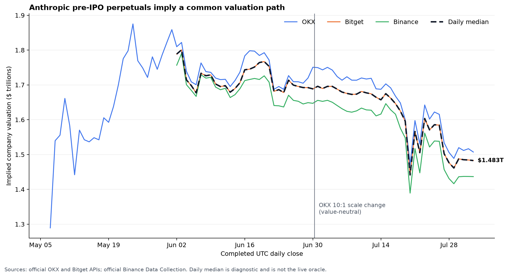
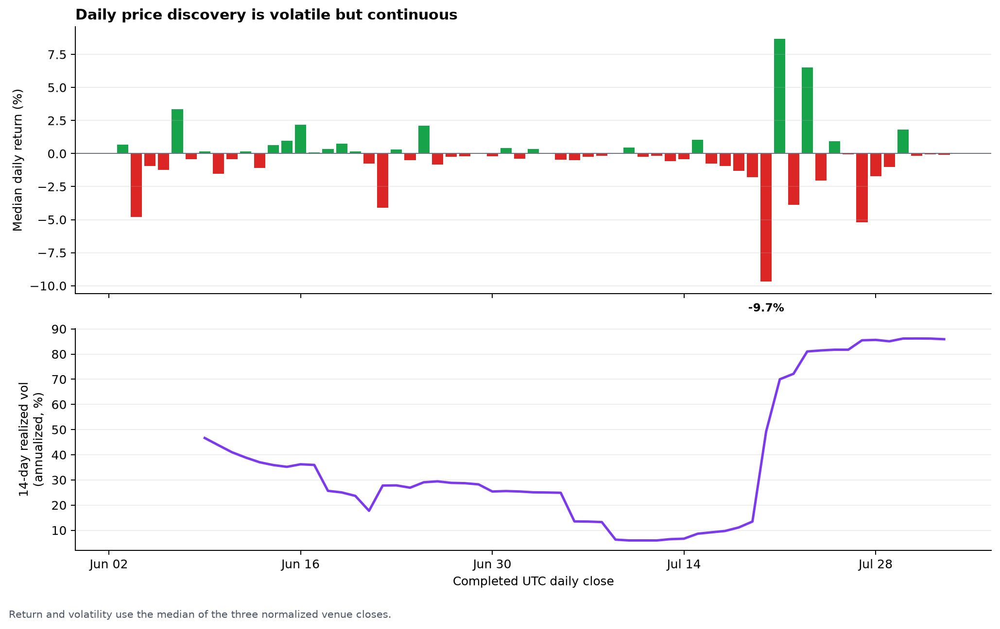
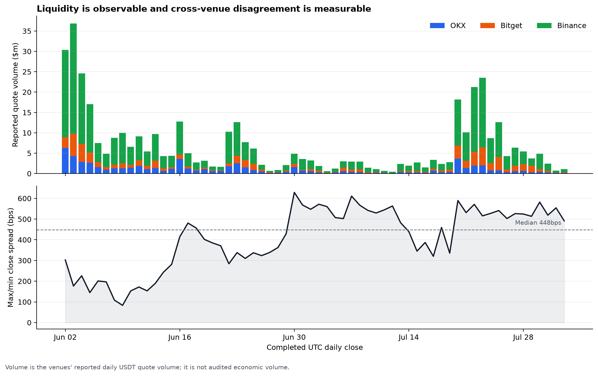

# Historical pricing research

This report tests whether the three publicly traded Anthropic pre-IPO
perpetuals exhibit coherent, volatile price discovery. It uses only completed
UTC daily candles supplied by OKX, Bitget, and Binance and is reproducible from
the code and source links in this repository.

**Fixed research cutoff:** August 3, 2026 at 00:00 UTC. The final included
observation is August 2, 2026.

> This is a historical sanity check, not the production oracle. The live oracle
> uses $10,000 executable bid/ask impact prices, a 30-second per-venue TWAP, and
> explicit source-health rules. Daily OHLC data cannot reproduce that intraday
> calculation.

## Results at a glance

| Metric | Observation |
|---|---:|
| Common three-venue history | June 2–August 2, 2026 |
| Completed common observations | 62 days |
| First three-venue median | $1.789T |
| Latest three-venue median | $1.483T |
| Common-period return | −17.1% |
| Annualized realized volatility | 45.5% |
| Median absolute daily move | 0.58% |
| Largest daily move | −9.66% on July 20 |
| Pairwise daily-return correlations | 0.967–0.989 |
| Median max/min venue-close spread | 448bps |
| 95th-percentile venue-close spread | 581bps |
| Maximum venue-close spread | 629bps |
| Median aggregate reported daily volume | $3.99M |
| Latest-30-day average reported daily volume | $5.16M |
| Latest-30-day total reported volume | $154.85M |

The central result is strong: the three independently traded contracts move
together extremely closely in returns while remaining volatile enough to look
like genuine growth-equity price discovery. The persistent difference in their
absolute levels is also economically important. It supports using a transparent
multi-venue composite rather than pretending that one venue is the uniquely
correct valuation.

## Valuation history



On August 2, the completed UTC closes implied:

| Venue | Implied valuation |
|---|---:|
| OKX | $1.507T |
| Bitget | $1.483T |
| Binance | $1.437T |
| Daily median | **$1.483T** |

The daily median is shown only as a diagnostic. The live oracle uses an
equal-weighted, capped composite of executable per-venue TWAPs after rejecting
unhealthy or divergent inputs.

## Volatility



The normalized median produced 45.5% annualized realized volatility over the
common sample. Its largest one-day change was −9.66% on July 20. This is
consistent with the expected behavior of a high-duration frontier-AI equity
exposure and contradicts the smooth, stale behavior one would expect from a
quarterly private-market mark or a redeemable ETF pinned to manager NAV.

## Liquidity and cross-venue dispersion



Latest-30-day reported quote volume was concentrated as follows:

| Venue | Reported volume | Share |
|---|---:|---:|
| Binance | $106.45M | 68.7% |
| Bitget | $29.60M | 19.1% |
| OKX | $18.80M | 12.1% |
| **Total** | **$154.85M** | **100.0%** |

Reported exchange volume is not the same as unique directional demand and may
include market-maker, arbitrage, or other repeated turnover. It nevertheless
shows that price formation is not confined to one inactive wrapper. Binance is
the largest liquidity source, but Bitget and OKX provide independent prices and
operational redundancy.

The median daily max/min close spread was approximately 4.48%. That is too large
to describe the venue levels as interchangeable, but well inside the oracle's
10% full-weight band. The live calculation further replaces daily closes with
simultaneous executable impact prices and short per-venue TWAPs.

## Return-correlation matrix

| | OKX | Bitget | Binance |
|---|---:|---:|---:|
| **OKX** | 1.000 | 0.970 | 0.967 |
| **Bitget** | 0.970 | 1.000 | 0.989 |
| **Binance** | 0.967 | 0.989 | 1.000 |

These correlations use aligned UTC close-to-close percentage returns over dates
where all three venues reported completed candles. An earlier unaligned test
using Bitget's local-day `1D` candles materially understated correlation; the
checked-in pipeline explicitly requests `1Dutc` to prevent that error.

## Contract normalization and the OKX rebase

Raw ticker prices cannot be averaged directly because the contracts use
different nominal share bases:

| Venue and period | Nominal share basis | Conversion |
|---|---:|---|
| OKX before June 30 rebase | 1B | raw price × 1B |
| OKX after June 30 rebase | 10B | raw price × 10B |
| Bitget | 1B | raw price × 1B |
| Binance | 1B | raw price × 1B |

OKX one-minute candles show the scale change between 08:05 and 08:06 UTC on
June 30:

| Minute | Raw close | Basis | Implied valuation |
|---|---:|---:|---:|
| 08:05 UTC | 1,715.34 | 1B | $1.715T |
| 08:06 UTC | 171.53 | 10B | $1.715T |

The approximately tenfold raw-price change therefore did not represent a 90%
economic loss. June 30's daily OHLC range straddles both scales and is flagged
`mixed_basis_daily_ohlc=true` in the normalized dataset. Only its post-rebase
close is used in the valuation series.

OKX's original listing notice states that the pre-IPO contract initially used a
one-billion estimated share count and that proportional rebases preserve
position value. The exact June 30 transition used here is independently visible
in the official OKX candle history. Because no separate indexed announcement of
that specific rebase was located, the basis transition is explicitly labeled as
an exchange-data inference rather than silently treated as static metadata.

## Reproduce the analysis

From the repository root:

```bash
python3 -m venv .venv-research
.venv-research/bin/pip install -r requirements-research.txt

# Re-download primary-source history and rebuild everything through Aug. 2.
.venv-research/bin/python research/build_history.py --as-of 2026-08-03

# Regenerate charts and statistics without any network calls.
.venv-research/bin/python research/build_history.py \
  --offline --as-of 2026-08-03

# Execute the notebook as an additional reproducibility check.
.venv-research/bin/jupyter nbconvert \
  --execute --to notebook \
  --output /tmp/anthropic_perp_history.ipynb \
  research/anthropic_perp_history.ipynb
```

The normalized long-form CSV has SHA-256:

```text
0e4c6180adc1acfe3b190215f4d53cd7dd522f6ecbc1d85f406e6a0bc3fae793
```

## Auditable artifacts

- [`build_history.py`](build_history.py): acquisition, normalization, metrics,
  plots, and notebook generation.
- [`anthropic_perp_history.ipynb`](anthropic_perp_history.ipynb): executable
  analysis notebook.
- [`anthropic_perp_daily.csv`](data/anthropic_perp_daily.csv): normalized
  long-form observations with source URL on every row.
- [`anthropic_perp_daily_wide.csv`](data/anthropic_perp_daily_wide.csv): one row
  per day for spreadsheet review.
- [`historical_summary.json`](data/historical_summary.json): machine-readable
  headline results.
- [`charts/`](charts/): PNG and SVG outputs.

## Primary sources

- [OKX original Anthropic pre-IPO listing notice](https://www.okx.com/help/okx-to-list-pre-ipo-pre-market-perpetual-futures-for-spacex-usdt-openai-usdt-and-anthropic-usdt)
- [OKX historical-candles API](https://www.okx.com/docs-v5/en/#rest-api-market-data-get-candlesticks-history)
- [Bitget historical-candles API](https://www.bitget.com/api-doc/contract/market/Get-History-Candle-Data)
- [Binance USD-M futures kline API](https://developers.binance.com/docs/derivatives/usds-margined-futures/market-data/rest-api/Kline-Candlestick-Data)
- [Official Binance public-data repository](https://github.com/binance/binance-public-data)
- [Official Binance Data Collection archive](https://data.binance.vision/)

## Limitations

- Daily candles do not capture intraday spreads, order-book depth, or the live
  30-second impact-price calculation.
- Venue contracts are cash-settled derivatives, not claims on Anthropic equity.
- Nominal share bases are contract conventions, not Anthropic's legal diluted
  share count.
- Reported quote volume is supplied by each venue and is not independently
  audited here.
- The daily median is intentionally simple and descriptive; it is not used for
  liquidations, funding, or final settlement.
- Historical agreement does not eliminate common-mode venue, legal, settlement,
  or market-manipulation risk.
